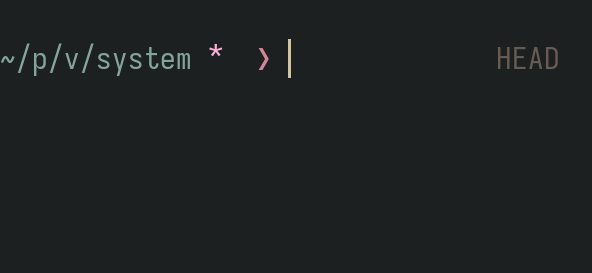
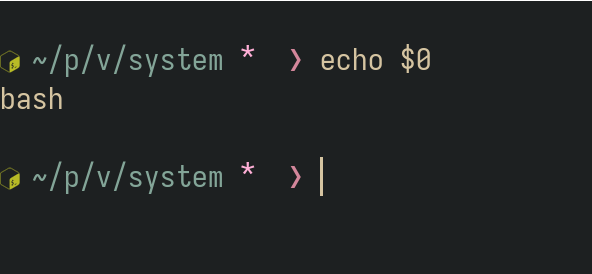
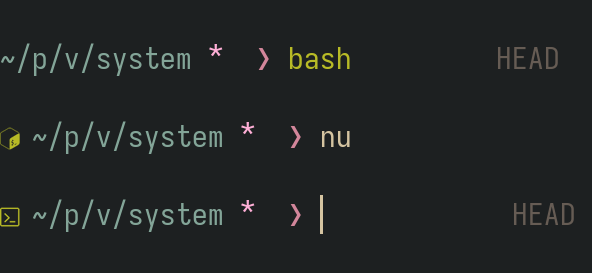

## The problem

I am an avid user of [starship](https://github.com/starship/starship) for all my shell prompt needs.
It is clean, it can be as minimalist or maximalist as you want, it is reasonably fast and can
replace most of the looks of other well-known shell prompts such as
[powerlevel10k](https://github.com/romkatv/powerlevel10k),
[pure](https://github.com/sindresorhus/pure), [geometry](https://github.com/geometry-zsh/geometry)
and more, only it does so in a single program with access to the same wide prompt module library for
each of the themes.



Personally, I have it set up to closely mimic the `pure` prompt.
My prompt displays a very simple shortened path to the current working directory,
some git, jujutsu, or fossil information if in a version-controlled location,
the version of the current framework or library such as python, nodejs, go or lua,
and a few other bits and bolts such as a hostname if working remotely or the current sudo access.

Nothing too extravagant but pertinent information right at your fingertips.

I also semi-regularly work in multiple different shell environments:
my 'cozy home' and standard environment is `zsh`,
though I often have to be in a `bash` environment,
and, increasingly, try to jump into `nushell` for some more advanced data pipelining.

All of these shells I set up to have exactly the same layout and information displayed.
This is amazing for knowing where everything is and not ever having the prompt get in my way,
regardless of working environment.

The trouble is also, however, that they are _exactly_ the same.
Sometimes it can happen that I actually forget which shell environment I am currently working in.
And while between `bash` and `zsh` the effective difference for commands is often marginal
(having also set up keybinds for both to work as much in the same way that I could),
whenever I forget that I am in `nushell`, or am unsure if I am, this creates more trouble.

## The solution

Thankfully, with [custom commands](https://starship.rs/config/#custom-commands) provided by
starship, we can extend the prompt functionality to help us out.

By checking which shell we are running currently, we can subtly change the prompt display _without_
losing all the additional niceties that starship gives us,
and while still keeping the overall theme exactly the same across shells.

The idea is to simply display an unobtrusive character or, in my case, nerdfont icon in front of the
main prompt for the shell that are not my main one.
This way I can assume, by default, that I am working in `zsh` but if I see one of the small symbols
I can never forget that I am in fact working in another shell at that moment.



The code to implement this is fairly straightforward. In addition to your existing configuration in
your `~/.config/starship.toml` configuration file, simply add the following:

```toml ins={6,15-17,19-21}
# Get editor completions based on the config schema
"$schema" = 'https://starship.rs/config-schema.json'

format = """
$sudo\
$custom\
$username\
$directory\
$git_state\
$git_status\
$status\
$character\
"""

[custom.shell_bash_indicator]
command = 'echo '
when = ' test "$0" = "/usr/bin/bash" '

[custom.shell_nushell_indicator]
command = 'echo '
when = ' test $env._ == "/usr/bin/nu" '
```

The principle is simple:\
we test which binary is currently running our shell process,[^shelldetection]
and if it is the shell we expect (in my case either `bash` or `nu`) we echo a single-character icon.

[^shelldetection]: Note that this way of testing is _not_ bullet-proof, as explained on [this
    askubuntu
question](https://askubuntu.com/questions/590899/how-do-i-check-which-shell-i-am-using), and [this
stackoverflow
post](https://stackoverflow.com/questions/3327013/how-to-determine-the-current-interactive-shell-that-im-in-command-line).
But it should generally be a good enough heuristic for our non-critical purposes of displaying a
little symbol.

Really, you can put anything here for the output, even a full `[BASH]` message if that is more your
style,
all you have to do is change the respective `echo` line of the `command` options.
But the basic principle doesn't change.
It can presumably also be extended to check other arbitrary shells (if anyone jumps between `xonsh`,
`elvish` or, more likely, `fish`, and so on).



Now, of course this slows down each prompt display slightly but I haven't noticed any egregious
differences so far, and I've been using it for a while.

One last thing which irks me, and perhaps somebody actually has a better option here:
it took me a while to figure out a way of checking for the `nu` shell binary,
until I stumbled upon the `_` environment variables which contains it.

But the `test` syntax itself is so different for the shell that running the test command as-is in
the other shells actually produces an error output on stderr.
I have not run into problems with this so far, but I have a feeling it will come back to bite me at
some inopportune moment,
and beyond that just feels a bit messy.

If anyone has an idea for improvement here, please let me know so I can update my configuration
accordingly.
Otherwise this is all there is to it.
Simple process, but very nice quality-of-life improvement for multi-shell workflows with the
starship prompt.
