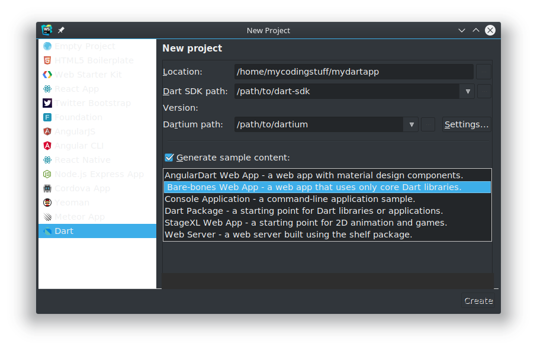

## Moving from Abstract Concepts to a Dart Implementation

Blog flow:

- canvas access
- Pixel access
- pixel editing - greyscale
- quantization
- dithering
- Going further
  - function chaining
  - library
  - image uploading
  - making interface

While the [last post](/2018-02-19) spoke about the concepts behind Dithering and
Quantization, let's see in this one how we can actually implement it in HTML5,
together with Dart as our language. The first little section here will only deal
with the basics of setting up dart as part of your html page in the first place,
so that can easily be skipped.

## Getting Dart

Dart is an alternative to Javascript from Google. It is strongly typed (but
still carries type inference possibilities), has neat asynchronous and stream
features and is overall much more comfortable to me than Javascript itself ever
was (though I have done little in ES6).

To install dart on your system, you will need to install some version of the
dart-sdk, and to see your progress in the browser without complicated compiling
steps it is recommended for now to install dartium (a chromium version which
displays uncompiled dart) as well. Both can be gotten here:

[https://www.dartlang.org/install](https://www.dartlang.org/install)

Follow the instructions and you should have a functioning version of dart on
your system. If you want code completion, simple compiling, testing and a host
of other comfort features, you can write your dart code in Webstorm as is pretty
much recommended from the dartlang website. If you do so, you can also let dart
scaffold your web-app for you, simply click `New Project` in Webstorm, select
Dart and select the pre-made Barebones web template. Then you can skip the next
part on scaffolding the app yourself.



## Scaffolding

To get set up we need to create a main `.dart` file which will be embedded in
the page that will provide the canvas for our experimentation. So let's create a
new dart file and for now just create an empty main function - as with so many
other languages this will be the entry point of the program.

~main.dart~

```dart
void main() {

}
```

To actually show something in the browser we of course need an html file which
is called `index.html`. This file contains our markup as usual, but it will also
need two specific things for our program to realize we want to embed dart code
and to display an image. In the html file, we need to link two scripts, the dart
javascript and our main dart file. So for now, let us do:

~index.html~

```html
<!DOCTYPE html>
<html>
  <head>
    <title>Dithering Dithering</title>
    <script defer src="main.dart" type="application/dart"></script>
    <script defer src="packages/browser/dart.js"></script>
  </head>
  <body>
    <canvas id="input"></canvas>
    <canvas id="output"></canvas>
  </body>
</html>
```

As you can see, we have added the links to our `main.dart` file, as well as the
actual dart library as a javascript file in the head. In the body, we have added
two HTML5 canvasses, which we will later use to display the results of our
dithering work. In this case, I have added two canvasses - one called input, one
called output, to display the original and the edited image side-by-side, but of
course that is not strictly necessary. We can display only the result, we can
display neither (maybe we just want to use it to superimpose on another image or
guide some sort of flow?), we can do whatever we want.

Of course, right now, when we start up our browser with this setup all we see is
an empty page. We don't display anything yet, and even if we did - our browser
is not set up properly to work with dart files.

## Viewing in Browser
