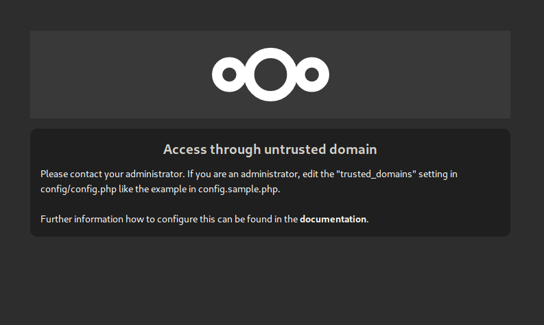

When setting up Nextcloud on your own server,
you will undoubtedly have run across one specific issue of accessing the page later:



The secret to fixing this is generally pretty simple.
In your Nextcloud `config.php` file, there is an array of domains that are allowed to access the server.

It contains a php array entry like the following:

```php
'trusted_domains' =>
  array (
    0 => 'localhost',
  ),
```

What you essentially want to do is add all the domains
(*with* their subdomains!)
you want to access your Nextcloud instance from.

```php
'trusted_domains' =>
  array (
    0 => 'localhost',
    1 => 'files.myserveraddress.me',
    2 => 'nextcloud.myserveraddress.freeddns.org',
  ),
```

Done, you should be able to access your instance.

## Docker setup

However, since you may be running Nextcloud through Docker,
you don't want to manually change options in the containers' file system around ---
this would destroy much of the reproducability granted by containers.

If you are using `docker-compose` or `docker stack`s to deploy your instance,
there is an easy fix here as well.

Simply add an environment variable called `NEXTCLOUD_TRUSTED_DOMAINS` to your setup,
like:

```yml
services:
  app:
    image: nextcloud:latest
    networks:
      - public
      - backend
    volumes:
      - data:/var/www/html
    environment:
      - NEXTCLOUD_ADMIN_USER={{ nextcloud_app_admin_username }}
      - NEXTCLOUD_ADMIN_PASSWORD={{ nextcloud_app_admin_password }}
      - POSTGRES_HOST={{ nextcloud_db_host }}
      - POSTGRES_DB={{ nextcloud_db_username }}
      - POSTGRES_USER={{ nextcloud_db_username }}
      - POSTGRES_PASSWORD={{ nextcloud_db_password }}
      - NEXTCLOUD_TRUSTED_DOMAINS={{ nextcloud_trusted_domains }}
```

Here, you replace the intended array entries with a list of entries separated by *spaces*:

```yml
      - NEXTCLOUD_TRUSTED_DOMAINS="files.myserveraddress.me nextcloud.myserveraddress.freeddns.org"
```

And, assuming you filled out the variables for an automatic setup of Nextcloud above,
on container creation it will run the setup process and automatically fill out the array for you.

You can read up on the possibilities of environment variable setups with `docker-compose` files in its README [here](https://github.com/docker-library/docs/blob/master/nextcloud/README.md).

Trusted domains, out of the box.
