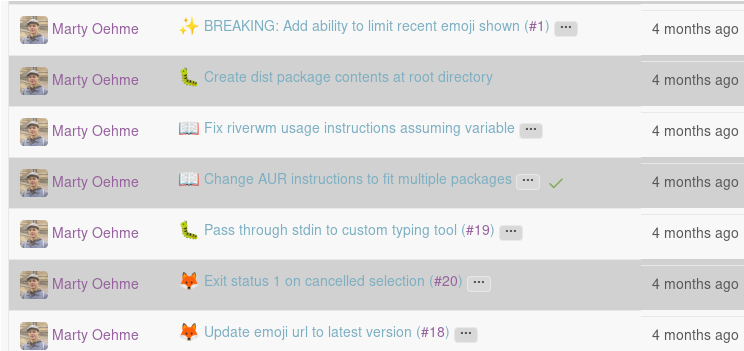
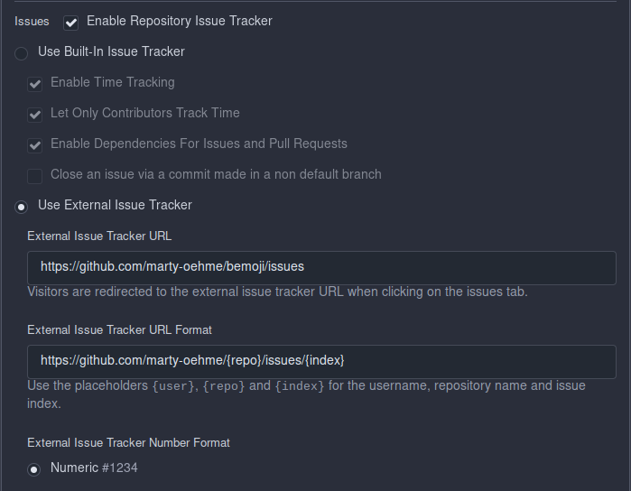
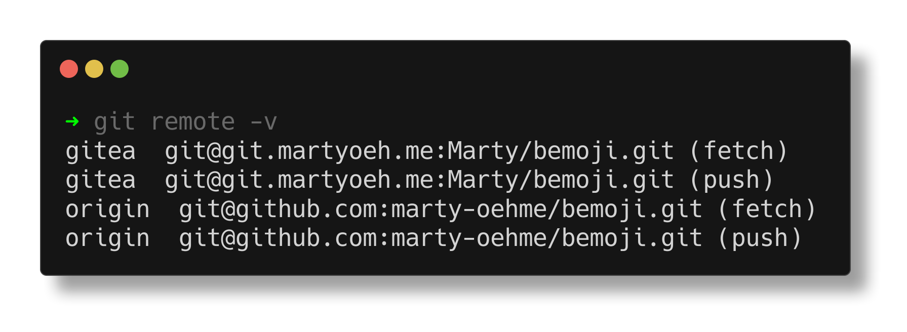
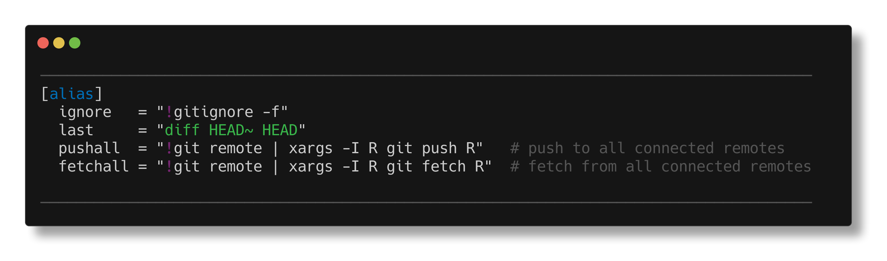

I am hosting my own git forge running Gitea on this very server,
and I love the platform.
It is snappy, it focuses on the essentials of showing, working with, presenting and improving my code;
it integrates well with my continuous integration platform, also self-hosted,
and it just overall *works* without any additional pain-points.

That is, except for one: community interaction.
I know that when I write some code and put it on my Gitea instance that it will be me developing the project,
and me alone.
There will scarcely be any issue reports, stars, comments or similar interactions,
let alone active pull requests.
And of course it makes sense for a platform hosted by me in the (web) middle of nowhere -
I don't expect my landingpage or blog to make huge waves in the community,
why should a forge be different.

And yet, it is one of the primary draws of open source for me:
other people can come along, take a look behind the scenes,
see how everything is done and improve it or tell you about issues they had and you go out and improve it together.
I think I have found a good compromise nowadays of developing primarily on my own instance of Gitea,
while still able to interact with other open source enthusiasts through GitHub.

Currently I am hosting all my projects on my own Gitea instance.
I have a [woodpecker](https://woodpecker-ci.org/) worker connected to take care of any CI or deployments that need to be happening.[^1]
At the same time, I also host any project that I feel benefits from community input on GitHub.

[^1]: Which, by the way, is integrated wonderfully into the Gitea interface that it feels absolutely seamless.



The first way this integration is made more painless it by redirecting all issues to one of the two instances.
Logically this will be GitHub since that is the platform with the bigger userbase,
and the one that does not offer an option to have it show up somewhere else easily.
Gitea on the other hand does, and the way they go about it is wonderful:

Look at the screenshot above, especially at commits which are pertinent to an issue.
They are marked with the typical `#1`, `#19` issue numbers that we all know from the various forges.
Only, these links lead *directly* to the correct issue on GitHub - 
even though we are currently in the Gitea commit log. 
Isn't that fantastic?



The way to set it up is in Gitea repository settings to find the 'Issues' section.
Make sure that issues are enabled, but an external issue tracker is used. 
The url you give it will replace the usual issue button on top of your repository.
Then you set up the external tracker format; 
for GitHub it is `https://github.com/{user}/{repo}/issues/{index}` and make sure to have
`Numeric` issues enabled.[^2]
Done! 
You never have to think about issue integrations again,
they are just working now -
whenever an issue is mentioned in-text Gitea will redirect it to the GitHub issue tracker.

[^2]: This requires your username to be the same on both platforms. If it is not, simply replace `{user}` with your actual username on GitHub. That does mean the connection will stop working if you ever change your username on the platform however.



Locally, the two repositories can simply be two remotes on the same git project.
You will typically have your `origin` instance (the 'primary' remote, if you want),
and can add any others with `git remote add remotename git@github.com:NAME/REPO.git`
(where `remotename` is simply a readable name for you, I tend to just use the descriptive `github` or `gitea`).

Now, we can push separately to both instances with `git push gitea` or `git push origin` 
(which can be shortened to `git push`).[^3]

[^3]: I keep having to remind myself of the actual long-form commands since my shell aliases for them are so ingrained by now: `gp` to push somewhere, `gra` to add a remote, `grv` to show current remotes and finally `grr` to remove a remote.



To ease pushing to all remotes simultaneously you can set up a git alias in the `~/.config/git/config` git configuration file.
By setting `pushall = "!git remote | xargs -I R git push R"` you first list all remotes and then push to each one.
I have furthermore aliased this to `alias gpa="git pushall"` in my shell, so all I have to do is `gpa` and all remotes are current.

While Gitea does provide a mirror functionality, this does not work well for my use cases:

Pulling from GitHub to Gitea means I *have* to do all my primary programming work on GitHub and will only have the changes pulled to Gitea after a set amount of polling time.
Not only does this feel somewhat restricting after having gone through all the trouble of setting up an independent Gitea forge,
but it also massively delays things like the CI workers I have running on my Gitea instance.

Pushing to GitHub on the other hand generally works pretty well -
until it comes to working with **pull requests**.
I have not figured out any reasonably comfortable way to integrate someone elses PR from Gitea without either mangling their contribution or overwriting their commit ownership if using push mirrors.

Thus, the compromise of multiple remotes and redirected issue tracking which works well enough for me.

By the way, to work locally on someone else's pull request you can just do 

```bash
git fetch github pull/<PR-id>/head:<name-of-new-local-branch>
```

where `github` is the name of the remote pointing to github. 
This will simply take the pull request branch and add it as a normal branch to your project ready to check out,
work on, rebase, and so on.
For review comments I have to resort to the GitHub interface for now unfortunately.

Conversely, if you are satisfied with the changes you can directly push to a pull request's branch by doing

```bash
git push <path-to-their-fork-repository.git> <name-of-local-branch>
```

This should not come as much of a surprise thinking about it of course 
(it is just pushing to another git remote after all),
but I was still pleasantly surprised when it just worked like that.

Beware that this of course only works if you are still allowed by the fork to push onto its pull request branch.
All changes and new commits will appear in the GitHub pull request discussion screen and can be part of further reviews.

All in all, this provides a reasonably comfortable way for me to work with others while still keeping my code on an independent forge and not having to interact too much with GitHub's own interface.
The two moments that I am interacting with it are issue tracking and pull request review commenting - 
two areas which I believe GitHub still shines in for community interaction.

Keep in mind that everything mentioned here should also work for any hosted instances of Gitea or Forgejo,
such as [codeberg](https://codeberg.org) and some of it even to similar open forge platforms such as [gogs](https://gogs.io/) or [sourcehut](https://sourcehut.org/).

