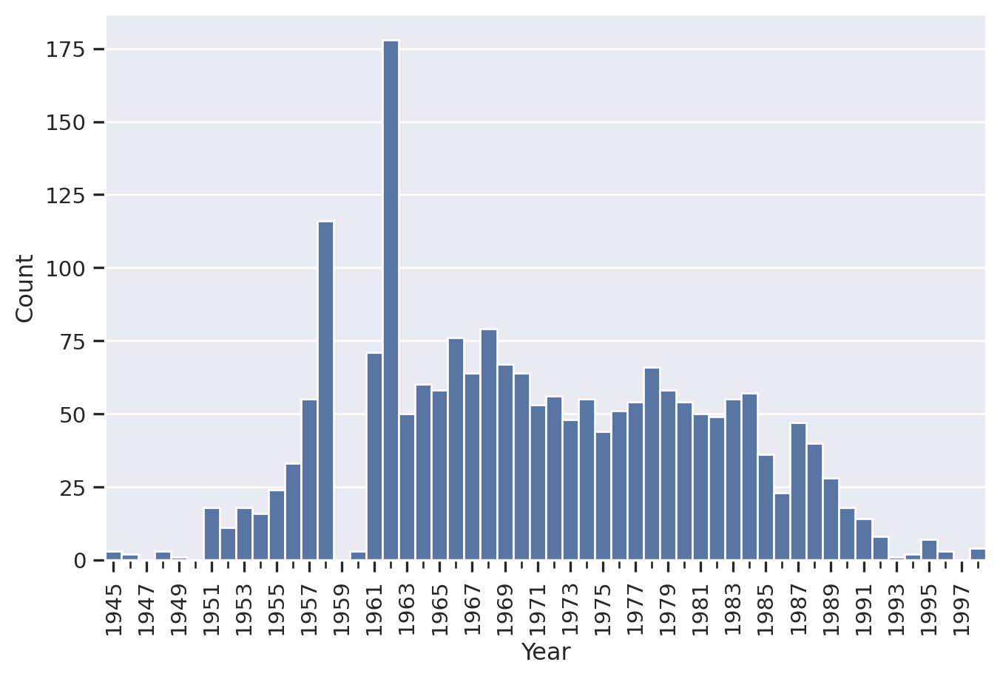
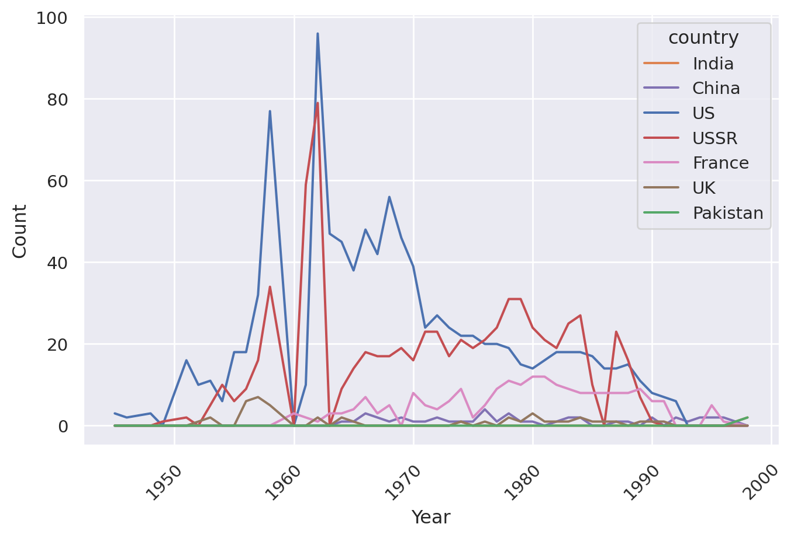
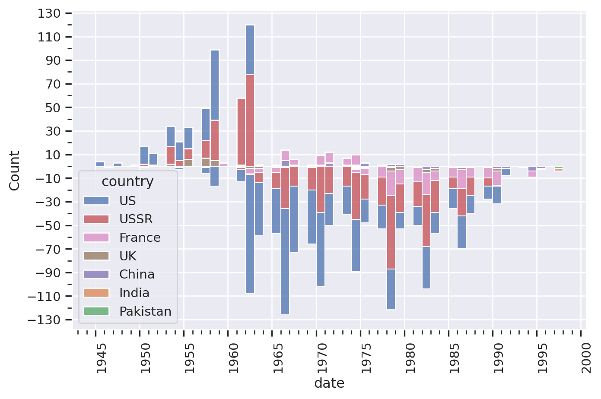
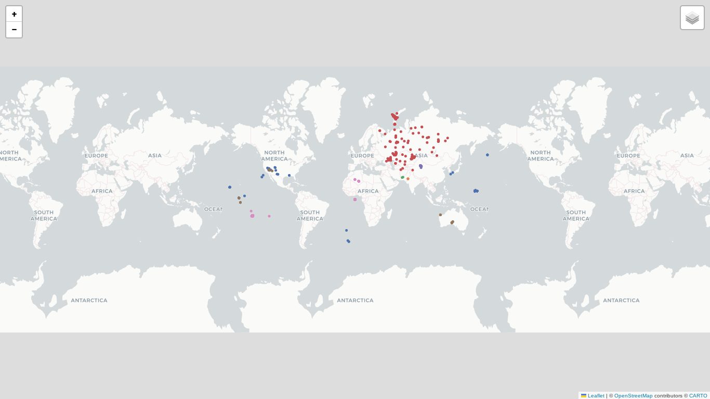

<script src="https://cdnjs.cloudflare.com/ajax/libs/require.js/2.3.6/require.min.js" integrity="sha512-c3Nl8+7g4LMSTdrm621y7kf9v3SDPnhxLNhcjFJbKECVnmZHTdo+IRO05sNLTH/D3vA6u1X32ehoLC7WFVdheg==" crossorigin="anonymous"></script>
<script src="https://cdnjs.cloudflare.com/ajax/libs/jquery/3.5.1/jquery.min.js" integrity="sha512-bLT0Qm9VnAYZDflyKcBaQ2gg0hSYNQrJ8RilYldYQ1FxQYoCLtUjuuRuZo+fjqhx/qtq/1itJ0C2ejDxltZVFg==" crossorigin="anonymous" data-relocate-top="true"></script>
<script type="application/javascript">define('jquery', [],function() {return window.jQuery;})</script>


<details class="code-fold">
<summary>Code</summary>

``` python
schema_overrides = (
    {
        col: pl.Categorical
        for col in ["type", "name", "purpose", "country", "source", "region"]
    }
    | {col: pl.Float64 for col in ["magnitude_body", "magnitude_surface"]}
    | {col: pl.String for col in ["year", "name"]}
)

cty_alias = {
    "PAKIST": "Pakistan",
    "FRANCE": "France",
    "CHINA": "China",
    "INDIA": "India",
    "USA": "US",
}


def cty_replace(name: str) -> str:
    if name in cty_alias:
        return cty_alias[name]
    return name


df = (
    pl.read_csv(
        "data/nuclear_explosions.csv",
        schema_overrides=schema_overrides,
        null_values=["NA"],
    )
    .with_columns(
        date=pl.col("year").str.strptime(pl.Date, "%Y"),
        country=pl.col("country").map_elements(cty_replace, return_dtype=pl.String),
    )
    .with_columns(year=pl.col("date").dt.year().cast(pl.Int32))
)
```

</details>

## Introduction

The following is a re-creation and expansion of some of the graphs found in the Bergkvist & Ferm (2000) produced report on nuclear explosions between 1945 and 1998. It is primarily a reproduction of key plots from the original report. Additionally, it serves as an exercise in plotting with the python library seaborn and the underlying matplotlib. Lastly, it approaches some less well tread territory for data science in the python universe as it uses the python library polars-rs for data loading and transformation. All the code used to transform the data and create the plots is available directly within the full text document, and separately as well. PDF and Docx formats are available with the plotting results only.

The authors' original purpose was the collection of a long list of all the nuclear explosions occurring between those years, as well as analysing the responsible nations, tracking the types and purposes of the explosions and connecting the rise and fall of nuclear explosion numbers to historical events throughout.

## Total numbers

> **Nuclear devices**
>
> There are two main kinds of nuclear device: those based entirely, on fission, or the splitting of heavy atomic nuclei (previously known as atomic devices) and those in which the main energy is obtained by means of fusion, or of -light atomic nuclei (hydrogen or thermonuclear devices). A fusion explosion must however be initiated with the help of a fission device. The strength of a fusion explosion can be practically unlimited. The explosive power of a nuclear explosion is expressed in kilotons, (kt) or megatons (Mt), which correspond to 1000 and 1 million tonnes, of conventional explosive (TNT), respectively.
>
> (Bergkvist & Ferm, 2000, p. 6)

We begin by investigating a table containing all the absolute counts and yields each country had explode, seen in <a href="#tbl-yields" class="quarto-xref">Table 1</a>.

<details class="code-fold">
<summary>Code</summary>

``` python
from great_tables import GT

df_yields = (
    df.select(["country", "id_no", "yield_lower", "yield_upper"])
    .with_columns(yield_avg=pl.mean_horizontal(pl.col(["yield_lower", "yield_upper"])))
    .group_by("country")
    .agg(
        pl.col("id_no").len().alias("count"),
        pl.col("yield_avg").sum(),
    )
    .with_columns(yield_per_ex=pl.col("yield_avg") / pl.col("count"))
    .sort("count", descending=True)
)

us_row = df_yields.filter(pl.col("country") == "US")
yields_above_us = df_yields.filter(
    pl.col("yield_per_ex") > us_row["yield_per_ex"]
).sort("yield_per_ex", descending=True)
assert len(yields_above_us) == 3, "Yield per explosion desc needs updating!"

tab=(
    GT(df_yields)
    .tab_source_note(
        source_note="Source: Author's elaboration based on Bergkvist and Ferm (2000)."
    )
    .tab_spanner(label="Totals", columns=["count", "yield_avg"])
    .tab_stub(rowname_col="country")
    .tab_stubhead(label="Country")
    .cols_label(count="Count", yield_avg="Yield in kt", yield_per_ex="Yield average")
    .fmt_integer(columns="count")
    .fmt_number(columns="yield_avg", decimals=1)
    .fmt_number(columns="yield_per_ex", decimals=1)
)
del df_yields
tab
```

</details>
<div id="tbl-yields">
<div id="bktyokmowf" style="padding-left:0px;padding-right:0px;padding-top:10px;padding-bottom:10px;overflow-x:auto;overflow-y:auto;width:auto;height:auto;">
<style>
#bktyokmowf table {
          font-family: -apple-system, BlinkMacSystemFont, 'Segoe UI', Roboto, Oxygen, Ubuntu, Cantarell, 'Helvetica Neue', 'Fira Sans', 'Droid Sans', Arial, sans-serif;
          -webkit-font-smoothing: antialiased;
          -moz-osx-font-smoothing: grayscale;
        }

#bktyokmowf thead, tbody, tfoot, tr, td, th { border-style: none; }
 tr { background-color: transparent; }
#bktyokmowf p { margin: 0; padding: 0; }
 #bktyokmowf .gt_table { display: table; border-collapse: collapse; line-height: normal; margin-left: auto; margin-right: auto; color: #333333; font-size: 16px; font-weight: normal; font-style: normal; background-color: #FFFFFF; width: auto; border-top-style: solid; border-top-width: 2px; border-top-color: #A8A8A8; border-right-style: none; border-right-width: 2px; border-right-color: #D3D3D3; border-bottom-style: solid; border-bottom-width: 2px; border-bottom-color: #A8A8A8; border-left-style: none; border-left-width: 2px; border-left-color: #D3D3D3; }
 #bktyokmowf .gt_caption { padding-top: 4px; padding-bottom: 4px; }
 #bktyokmowf .gt_title { color: #333333; font-size: 125%; font-weight: initial; padding-top: 4px; padding-bottom: 4px; padding-left: 5px; padding-right: 5px; border-bottom-color: #FFFFFF; border-bottom-width: 0; }
 #bktyokmowf .gt_subtitle { color: #333333; font-size: 85%; font-weight: initial; padding-top: 3px; padding-bottom: 5px; padding-left: 5px; padding-right: 5px; border-top-color: #FFFFFF; border-top-width: 0; }
 #bktyokmowf .gt_heading { background-color: #FFFFFF; text-align: center; border-bottom-color: #FFFFFF; border-left-style: none; border-left-width: 1px; border-left-color: #D3D3D3; border-right-style: none; border-right-width: 1px; border-right-color: #D3D3D3; }
 #bktyokmowf .gt_bottom_border { border-bottom-style: solid; border-bottom-width: 2px; border-bottom-color: #D3D3D3; }
 #bktyokmowf .gt_col_headings { border-top-style: solid; border-top-width: 2px; border-top-color: #D3D3D3; border-bottom-style: solid; border-bottom-width: 2px; border-bottom-color: #D3D3D3; border-left-style: none; border-left-width: 1px; border-left-color: #D3D3D3; border-right-style: none; border-right-width: 1px; border-right-color: #D3D3D3; }
 #bktyokmowf .gt_col_heading { color: #333333; background-color: #FFFFFF; font-size: 100%; font-weight: normal; text-transform: inherit; border-left-style: none; border-left-width: 1px; border-left-color: #D3D3D3; border-right-style: none; border-right-width: 1px; border-right-color: #D3D3D3; vertical-align: bottom; padding-top: 5px; padding-bottom: 5px; padding-left: 5px; padding-right: 5px; overflow-x: hidden; }
 #bktyokmowf .gt_column_spanner_outer { color: #333333; background-color: #FFFFFF; font-size: 100%; font-weight: normal; text-transform: inherit; padding-top: 0; padding-bottom: 0; padding-left: 4px; padding-right: 4px; }
 #bktyokmowf .gt_column_spanner_outer:first-child { padding-left: 0; }
 #bktyokmowf .gt_column_spanner_outer:last-child { padding-right: 0; }
 #bktyokmowf .gt_column_spanner { border-bottom-style: solid; border-bottom-width: 2px; border-bottom-color: #D3D3D3; vertical-align: bottom; padding-top: 5px; padding-bottom: 5px; overflow-x: hidden; display: inline-block; width: 100%; }
 #bktyokmowf .gt_spanner_row { border-bottom-style: hidden; }
 #bktyokmowf .gt_group_heading { padding-top: 8px; padding-bottom: 8px; padding-left: 5px; padding-right: 5px; color: #333333; background-color: #FFFFFF; font-size: 100%; font-weight: initial; text-transform: inherit; border-top-style: solid; border-top-width: 2px; border-top-color: #D3D3D3; border-bottom-style: solid; border-bottom-width: 2px; border-bottom-color: #D3D3D3; border-left-style: none; border-left-width: 1px; border-left-color: #D3D3D3; border-right-style: none; border-right-width: 1px; border-right-color: #D3D3D3; vertical-align: middle; text-align: left; }
 #bktyokmowf .gt_empty_group_heading { padding: 0.5px; color: #333333; background-color: #FFFFFF; font-size: 100%; font-weight: initial; border-top-style: solid; border-top-width: 2px; border-top-color: #D3D3D3; border-bottom-style: solid; border-bottom-width: 2px; border-bottom-color: #D3D3D3; vertical-align: middle; }
 #bktyokmowf .gt_from_md> :first-child { margin-top: 0; }
 #bktyokmowf .gt_from_md> :last-child { margin-bottom: 0; }
 #bktyokmowf .gt_row { padding-top: 8px; padding-bottom: 8px; padding-left: 5px; padding-right: 5px; margin: 10px; border-top-style: solid; border-top-width: 1px; border-top-color: #D3D3D3; border-left-style: none; border-left-width: 1px; border-left-color: #D3D3D3; border-right-style: none; border-right-width: 1px; border-right-color: #D3D3D3; vertical-align: middle; overflow-x: hidden; }
 #bktyokmowf .gt_stub { color: #333333; background-color: #FFFFFF; font-size: 100%; font-weight: initial; text-transform: inherit; border-right-style: solid; border-right-width: 2px; border-right-color: #D3D3D3; padding-left: 5px; padding-right: 5px; }
 #bktyokmowf .gt_stub_row_group { color: #333333; background-color: #FFFFFF; font-size: 100%; font-weight: initial; text-transform: inherit; border-right-style: solid; border-right-width: 2px; border-right-color: #D3D3D3; padding-left: 5px; padding-right: 5px; vertical-align: top; }
 #bktyokmowf .gt_row_group_first td { border-top-width: 2px; }
 #bktyokmowf .gt_row_group_first th { border-top-width: 2px; }
 #bktyokmowf .gt_table_body { border-top-style: solid; border-top-width: 2px; border-top-color: #D3D3D3; border-bottom-style: solid; border-bottom-width: 2px; border-bottom-color: #D3D3D3; }
 #bktyokmowf .gt_sourcenotes { color: #333333; background-color: #FFFFFF; border-bottom-style: none; border-bottom-width: 2px; border-bottom-color: #D3D3D3; border-left-style: none; border-left-width: 2px; border-left-color: #D3D3D3; border-right-style: none; border-right-width: 2px; border-right-color: #D3D3D3; }
 #bktyokmowf .gt_sourcenote { font-size: 90%; padding-top: 4px; padding-bottom: 4px; padding-left: 5px; padding-right: 5px; text-align: left; }
 #bktyokmowf .gt_left { text-align: left; }
 #bktyokmowf .gt_center { text-align: center; }
 #bktyokmowf .gt_right { text-align: right; font-variant-numeric: tabular-nums; }
 #bktyokmowf .gt_font_normal { font-weight: normal; }
 #bktyokmowf .gt_font_bold { font-weight: bold; }
 #bktyokmowf .gt_font_italic { font-style: italic; }
 #bktyokmowf .gt_super { font-size: 65%; }
 #bktyokmowf .gt_footnote_marks { font-size: 75%; vertical-align: 0.4em; position: initial; }
 #bktyokmowf .gt_asterisk { font-size: 100%; vertical-align: 0; }
 
</style>

|                                                                   |                                               |             |               |
|-------------------------------------------------------------------|-----------------------------------------------|-------------|---------------|
| Country                                                           | <span class="gt_column_spanner">Totals</span> |             | Yield average |
|                                                                   | Count                                         | Yield in kt |               |
| US                                                                | 1,032                                         | 200,763.5   | 194.5         |
| USSR                                                              | 714                                           | 301,440.4   | 422.2         |
| France                                                            | 210                                           | 12,865.0    | 61.3          |
| UK                                                                | 45                                            | 9,603.3     | 213.4         |
| China                                                             | 45                                            | 21,389.5    | 475.3         |
| India                                                             | 3                                             | 20.5        | 6.8           |
| Pakistan                                                          | 2                                             | 26.5        | 13.2          |
| Source: Author\'s elaboration based on Bergkvist and Ferm (2000). |                                               |             |               |

</div>
        
Table 1: Total number and yields of explosions
</div>

It is interesting to note that while the US undoubtedly had the highest raw number of explosions, it did not, in fact, output the highest estimated detonation yields. In fact, 3 countries have a higher average explosion yield per detonation than the US: China leads with an average of 475.32 kt, before USSR with an average of 422.19 kt.

## Numbers over time

In the examination of global nuclear detonations, our initial focus shall be quantifying the annual incidence of the events in aggregate. While it obscures the specific details of the responsible nations and which diversity of types tested, it instead paints a much stronger picture of the overall abstracted dimension of nuclear testing throughout history, as depicted in <a href="#fig-total" class="quarto-xref">Figure 1</a>.

<details class="code-fold">
<summary>Code</summary>

``` python
per_year = df.group_by(pl.col("year")).agg(pl.len()).sort("year")
with sns.axes_style(
    "darkgrid", {"xtick.bottom": True, "ytick.left": True}
):
    g = sns.barplot(data=per_year, x="year", y="len", order=range(1945, 1999), width=1)
    g.set_xlabel("Year")
    g.set_ylabel("Count")
    plt.setp(
        g.get_xticklabels(),
        rotation=90,
        ha="right",
        va="center",
        rotation_mode="anchor",
    )  # ensure rotated right-anchor
    g.set_xticks(g.get_xticks(), minor=True) # enable minor ticks every entry
    g.set_xticks(g.get_xticks()[::2])  # enable major ticks every 2nd entry
    plt.show()
del per_year
```

</details>



As we can see, the number of explosions rises increasingly towards 1957 and sharply until 1958, before dropping off for a year in 1959. The reason for this drop should primarily be found in the start of the 'Treaty of Test Ban' which put limits and restraints on the testing of above-ground nuclear armaments, as discussed in the original article. Above all the contract signals the prohibition of radioactive debris to fall beyond a nation's respective territorial bounds.

However, this contract should perhaps not be viewed as the only reason: With political and cultural shifts throughout the late 1950s and early 1960s increasingly focusing on the fallout and horror of nuclear warfare a burgeoning public opposition to nuclear testing and instead a push towards disarmament was taking hold. The increased focus on the space race between the US and USSR may have detracted from the available funds, human resources and agenda attention for nuclear testing. Lastly, with nuclear testing policies strongly shaped by the political dynamics of the Cold War, a period of improved diplomatic relations such as the late 1950s prior to the Cuban missile crisis may directly affect the output of nuclear testing facilities between various powers.

<!-- TODO: Extract exact numbers from data on-the-fly -->

There is another, very steep, rise in 1962 with over 175 recorded explosions, before an even sharper drop-off the following year down to just 50 explosions. Afterward the changes appear less sharp and the changes remain between 77 and 24 explosions per year, with a slight downward tendency.

While these numbers show the overall proliferation of nuclear power, let us now instead turn to the contributions by individual countries. A split in the number of explosions over time by country can be seen in <a href="#fig-percountry" class="quarto-xref">Figure 2</a>.

<details class="code-fold">
<summary>Code</summary>

``` python
keys = df.select("date").unique().join(df.select("country").unique(), how="cross")
per_country = keys.join(
    df.group_by(["date", "country"], maintain_order=True).len(),
    on=["date", "country"],
    how="left",
    coalesce=True,
).with_columns(pl.col("len").fill_null(0))

g = sns.lineplot(data=per_country, x="date", y="len", hue="country", palette=country_colors)
g.set_xlabel("Year")
g.set_ylabel("Count")
plt.setp(
    g.get_xticklabels(), rotation=45, ha="right", rotation_mode="anchor"
)  # ensure rotated right-anchor
plt.show()
del per_country
```

</details>



Once again we can see the visibly steep ramp-up to 1962, though it becomes clear that this was driven both by the USSR and the US. Of course the graph also makes visible the sheer unmatched number of explosions emanating from both of the countries, with only France catching up to the US numbers and China ultimately overtaking them in the 1990s.

However, here it also becomes more clear how the UK was responsible for some early explosions in the late 1950s and early 1960s already, as well as the rise in France's nuclear testing from the early 1960s onwards to around 1980, before slowly decreasing in intensity afterward.

Let us turn to a cross-cut through the explosions in <a href="#fig-groundlevel" class="quarto-xref">Figure 3</a>, focusing on the number of explosions that have occurred underground and above-ground respectively.[^1]

<details class="code-fold">
<summary>Code</summary>

``` python
from polars import Boolean

above_cat = pl.Series(
    [
        "ATMOSPH",
        "AIRDROP",
        "TOWER",
        "BALLOON",
        "SURFACE",
        "BARGE",
        "ROCKET",
        "SPACE",
        "SHIP",
        "WATERSUR",
        "WATER SU",
    ]
)
df_groundlevel = (
    df.with_columns(
        above_ground=pl.col("type").map_elements(
            lambda x: True if x in above_cat else False, return_dtype=Boolean
        )
    )
    .group_by(pl.col("date", "country", "above_ground"))
    .agg(count=pl.len())
    .sort("date")
)

with sns.axes_style("darkgrid", {"xtick.bottom": True, "ytick.left": True}):
    for above_ground in [True, False]:
        g = sns.histplot(
            data=df_groundlevel.filter(
                pl.col("above_ground") == above_ground
            ).with_columns(
                count=pl.col("count") * (1 if above_ground else -1),
            ),
            x="date",
            weights="count",
            hue="country",
            multiple="stack",
            binwidth=365,
            palette=country_colors,
        )

    g.xaxis.set_major_locator(mdates.YearLocator(base=5))
    g.xaxis.set_minor_locator(mdates.YearLocator())
    plt.setp(
        g.get_xticklabels(), rotation=90, ha="right", va="top", rotation_mode="anchor"
    )
    # FIXME get dynamic range for yticks instead of hardcoding
    g.set_yticks(np.arange(-130, 140, 20))
    g.set_yticks(np.arange(-130, 140, 10), minor=True)
    plt.show()
del df_groundlevel
```

</details>



This plot paints a different picture yet again: while overall the number of explosions still rise and fall with some early sharp spikes, we can see a clear shift from above-ground to underground tests, starting with the year 1962.

## Locations

Finally, let's view a map of the world with the explosions marked, separated by country.

The map can be seen in <a href="#fig-worldmap-static" class="quarto-xref">Figure 4</a>.

<details class="code-fold">
<summary>Code</summary>

``` python
import folium
import geopandas as gpd

df_pd = df.with_columns().to_pandas().set_index("date")
gdf = gpd.GeoDataFrame(
    df_pd,
    crs="EPSG:4326",
    geometry=gpd.points_from_xy(x=df_pd["longitude"], y=df_pd["latitude"]),
)
del df_pd

def rgb_to_hex(rgb: tuple[float,float,float]) -> str:
    return "#" + "".join([format(int(c*255), '02x') for c in rgb])

m = folium.Map(tiles="cartodb positron")
for country in country_colors.keys():
    fg = folium.FeatureGroup(name=country, show=True).add_to(m)
    folium.GeoJson(
        gdf[gdf["country"] == country],
        name="Nuclear Explosions",
        marker=folium.Circle(radius=3, fill_opacity=0.4),
        style_function=lambda x: {
            "color": rgb_to_hex(country_colors[x["properties"]["country"]]),
            "radius": (
                x["properties"]["magnitude_body"]
                if x["properties"]["magnitude_body"] > 0
                else 1.0
            )
            * 10,
        },
        tooltip=folium.GeoJsonTooltip(fields=["year", "country", "type"]),
        highlight_function=lambda x: {"fillOpacity": 0.8},
        popup=folium.GeoJsonPopup(
            fields=[
                "year",
                "country",
                "region",
                "source",
                "latitude",
                "longitude",
                "magnitude_body",
                "magnitude_surface",
                "depth",
                "yield_lower",
                "yield_upper",
                "purpose",
                "name",
                "type",
            ]
        ),
    ).add_to(fg)
folium.LayerControl().add_to(m)
m
```

</details>
<details class="code-fold">
<summary>Code</summary>

``` python
# ENSURE SELENIUM IS INSTALLED
from PIL import Image
from IPython.display import Image as IImage
import io
img = m._to_png()

bimg = io.BytesIO(img)
Image.open(bimg).save("map.png")
IImage(url="map.png")
```

</details>
<div id="fig-worldmap-static">



</div>

> **Warning**
>
> Interactive maps not working
>
> Unfortunately, as of right now folium maps rendered within a quarto document do not seem to translate terribly well into an astro blog such as this. This is why, for now, there is only a static image here.
>
> This is very sad, but for the time being feel free to download and peruse the full repo with source documents [here](https://git.martyoeh.me/datasci/nuclear_explosions), as well as the [pdf](./index.pdf) or [docx](./index.docx) versions.

While there are undoubtedly more aspects of the data that provide interesting patterns for analysis, this shall be the extent of review for the time being for this reproduction.

We can see how the combination of python polars and seaborn makes the process relatively approachable, understandable and, combined with the rendering output by quarto, fully reproducible.

Additionally, we can see how additional projects can be included to produce interactive graphs and maps with tools such as folium and geopandas.

## References

Bergkvist, N.-O., & Ferm, R. (2000). *Nuclear Explosions 1945 - 1998* (pp. 1--42).

[^1]: Detonations counted as above ground are made up of atmospheric, airdrop, tower, balloon, barge or ship, rocket and water surface detonations. Any other detonation is counted as below ground, primarily taking place in tunnels, shafts and galleries.
