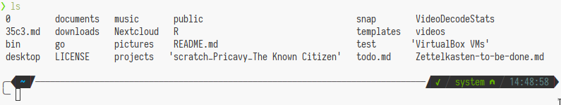

## Finding your way through directories

When I first started switching out GUIs for the commandline,
one of the biggest struggles I had were not necessarily complex commands,
commandline options or similar (since there generally exists good documentation for them),
but the basics of quickly moving around my directory structure.

More than that, even just *situating* yourself in whatever directory I found myself in was a hassle, if not a struggle.
Add to that my inexperience with the Unix file hierarchy,
and I was visibly confused at various points on this journey.
[^oldscripts]

[^oldscripts]: Heck, some of that confusion is still visible in the very early utility scripts I wrote. Go back to your old scripts at some points -- it's often hilarious and scary at the same time.

The most basic way of course is provided by `ls` to list directory contents.
But, `ls`, by default, only shows very little information:
it lists the names of things in the current directory
(or the one you point it at).



This can be changed by invoking `ls -l` for the long format
(including file ownership, permissions, and timestamps),
or using the well known form of `ls -hAl`.
This will list *all* files in the current directory,
including hidden ones,
display their size in a nicely readable format,
and some extra information.


In general, most of the things `exa` does,
and which we will see in a second,
can be replicated with `ls`.
However, this will involve a lot of tinkering
and mucking about.
[^lscolors]
Instead, `exa` does most of it out of the box, and some neat things on top!

[^lscolors]: Especially regarding getting nice coloring in `ls` for which you often have to set an obscure environmental variable, [see here](https://linuxhint.com/ls_colors_bash/)

## Using exa -- the basics


This is `exa` being invoked as `exa -l`,
so the long version just as above.
One thing that should be immediately obvious is the coloring.
`exa`, by default colors its output
[^autocolor]
and displays a nice unified scheme,
so that you can differentiate directories and files of certain kinds at a glance.
You can see that, by default,
files are not colored,
and folders are colored blue in my case.
Special files ---
like the README.md ---
get assigned their own special colors.

Additionally, it shows that the README.md file in my directory is actually only a symbolic link to another place,
in this case to my hidden dotfiles directory.
The permissions are nicely color-coded to allow quicker glancing at them,
and the access dates try to be helpful in their conciseness.

[^autocolor]: For human consumption. It tries its best not to color anything when used in a pipe or a script. By the way, don't use `ls` (or `exa`) in a script - [read here](https://unix.stackexchange.com/questions/128985/why-not-parse-ls-and-what-to-do-instead)

## exa and git

So far, so good.
But if you work a bit with `git`,
`exa` has another really nice quality of life feature for quickly assessing the current directory situation.


When invoked in a git-tracked directory with `exa -l --git`,
the program will automatically show you information on the current commit status for your files.
In this case you can see that I `M`-odified a file in my `a-fzf-workflow` directory,
and added `N`-ew files to the directory of this post.
For me, this provides invaluable overview when entering a tracking directory,
especially when I forgot what my last focus was, or where things need to be patched up.

## exa and tree

The last feature I want to highlight is `exa`'s ability to display your directory hierarchy in a tree structure.
A well known implementation of it exists in the [`tree`](https://manned.org/tree.1) program.


`exa` also comes with it equipped.
It can be enabled by calling `exa --tree` or `exa -T`, however,
doing so will make the program recurse into *each* singular directory under the current one.
Sometimes this is what you want,
oftentimes this is absolutely not what is intended and will lock up your PC for a bit
(just try in your home folder).
`exa` is fast, but this is a big task ---
not to speak of the impracticality of so many individual files being vomited at you.

For this reason, it comes equipped with filtering options.
In the case of tree view, you can invoke `exa -TL3` to go three levels deep,
`exa -TL4` for four levels, and so on.
You can see me doing so in the screenshot above,
telling `exa` to limit itself to two levels.

## aliases - finding the forest again

Finally, `exa`'s options are entirely unlike those of `ls`.
While their results can sometimes overlap,
the way you invoke them in `exa` is completely different
(like `exa --tree`, `exa --long --group --git-ignore`, and so on).

I have aliased my most used `exa` functions,
its basic long view and a shallow tree view,
into four quick-to-type shorcuts:

For the basic views:

`l` is aliased to `exa -l -git -git-ignore`, which will display git-tracked files and ignore those ignored by git.

`L` is aliased to `exa -hal -grid -git`, which will display *all* files (hidden and git ignored), and do so in a grid to save some display room since this often means a lot of files in the directory.

And similarly for the tree view:

`ll` is aliased to `exa --tree -L2`, to show me a 2-directory deep tree of my files

`LL` is aliased to `exa --tree -a -L2`, to show me the same tree with hidden files as well

I decided against following the git-ignored and git-tracked division from the basic views since this was getting in the way more often than helping when exploring in a tree-like structure ---
but you do you, [read](https://github.com/ogham/exa#filtering-options) about all the filtering options of `exa` and mix and match however you like!

The complete setup in my shell as of now is as follows[^exist]:

[^exist]: `exist` is not just pseudo-code but a little function in my shell environment which checks for the existence of a command, see it [here](https://gitlab.com/marty-oehme/dotfiles/-/blob/219f9a912dc5bb0b33d7bc2a5b9cd931a827521d/sh/.local/bin/exist)

```sh
# ls defaults
if exist exa; then
  alias l="exa -l --git --git-ignore"
  alias L="exa -hal --grid --git"
  # a recursive tree
  # - usually want to change levels recursed with -L2 -L3 or similar
  alias ll="exa --tree -L2"
  alias LL="exa -a --tree -L2"
else
  alias l="ls -lhF"
  alias L="ls -lAhF"
fi
```

That's the extent of my use for `exa`.
You can probably also use it for more advanced implementations of viewing and moving,
similarly to potential movement with `fzf`, which I talked a little about [here](../a-fzf-workflow).

For more involved movement and file operations,
I generally tend to use [`vifm`](https://vifm.info/),
as well as the wonderful [`fasd`](https://github.com/clvv/fasd) for quickly reaching any often-visited destination in my directory hierarchy.
