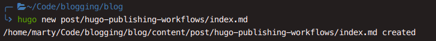

<!-- vale 18F.Titles = NO --> <!-- conflicts with Hugo spelling rule otherwise -->

## Letting Hugo create new posts

<!-- vale 18F.Titles = YES -->

Whenever you get the idea for a new post you want begin writing fast. In other
words, the path from idea to markdown editing needs to be as short as possible.
Most posts begin their life *outside* the content directory of Hugo. But we
still want to make the transition to the Hugo content directory as fast and
painless as possible.

Ideally, we want one command to create a post scaffold in the right place. With
Hugo archetypes this becomes easy to do. All we have to use is the command:
`hugo new post/my-post.md` and it will scaffold an empty article in its content
directory for us. This built-in Hugo functionality is pretty self-explanatory --
Hugo sets up a new post for us. How does Hugo do this? It uses [archetypes](https://gohugo.io/content-management/archetypes/).
It goes through its default archetypes to find the closest match and uses this
to scaffold new content. We can also customize its behavior to fully comply to
what we need out of our post skeletons![^front]

To customize the creation of new posts we create a new file `archetypes/post.md`
in the Hugo base directory.[^folder-structure] This file has the scaffold for
the new post creation for any `hugo new post` command. An example for the posts
on this blog:

```yaml
---
title: "Title"
description: "About the page"
pubDate: "{{ .Date }}"
tags: [ "" ]
weight: 10
---

## First Heading
```

As you can see, it's straightforward. You can use any Hugo variables and
template options for the scaffold. We make use of `{{ .Date }}` to save us
typing the full date every post. But you can go wild with it and use all sorts
of shortcuts. I use a default weight of 10 for posts on this blog, and our
scaffold respects this. Lastly, it already creates a first text-heading for me.
This is because my markdown linter expects a heading as the first thing of a
file (except for front-matter). Whenever I publish a new post Hugo takes care of
all this so I don't have to.

Little by little, I am switching to [page bundles](https://gohugo.io/content-management/page-bundles/)
for my content, and the command can respect that. Instead of the old command,
use `hugo new post/my-new-post-title/index.md` and the newly created post will
be a page bundle. You can even have the archetype be a folder which mirrors the
page bundle to create. Such archetype configuration goes beyond my needs for
this blog. If you need such customization take a closer look at the Hugo
archetype documentation linked above.

<!-- vale 18F.Titles = NO -->

## Editor integration -- Visual Studio Code

<!-- vale 18F.Titles = YES -->

Right now, my editor of choice to bring new posts online is [Visual Studio Code](https://code.visualstudio.com)[^VsCode].
The editor comes with an integrated terminal. To get a new post up, all I have
to do is open my editor, and hit ``Ctrl + ` ``. Then I can add the command we
learned above. We can make this even shorter by using extensions such as
[Hugo Language Support](https://marketplace.visualstudio.com/items?itemName=budparr.language-hugo-vscode)
or
[Hugo Helper](https://marketplace.visualstudio.com/items?itemName=rusnasonov.vscode-hugo).
With Visual Studio we can even create build and post creation shortcuts with
tasks. This is
[explained well here](www.ashwinnarayan.com/post/hugo-windows-workflow/#even-more-automation-with-visual-studio-code).
But once again these steps feel like overkill for my purposes -- we can already
create new posts with one command. And the publishing GitLab takes care of with
our [automatic deployment]().



<!-- vale off -->

[^front]: For example, we could have it automatically create a `js` key in our front-matter, populating it with whatever JavaScript we [want running on most pages]().
[^folder-structure]: This assumes your Hugo folder structure for posts is similar to the following: `content/post/many-many-posts.md`
[^VsCode]: Actually, it is vscodium, a completely open source implementation with Microsoft branding stripped out. But for the purposes of Hugo integration, they are factually identical.

<!-- vale on -->
