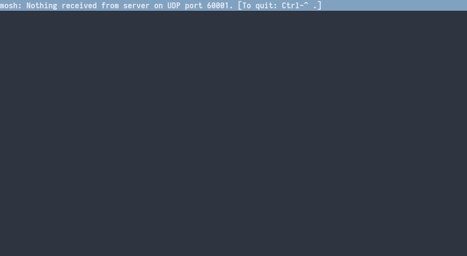
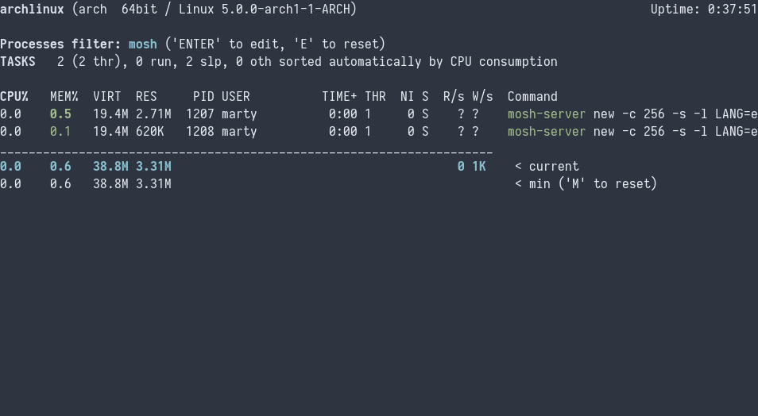
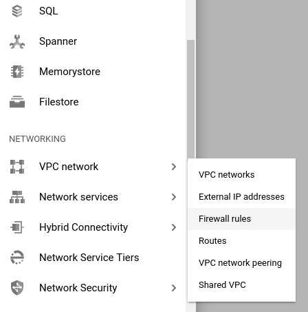
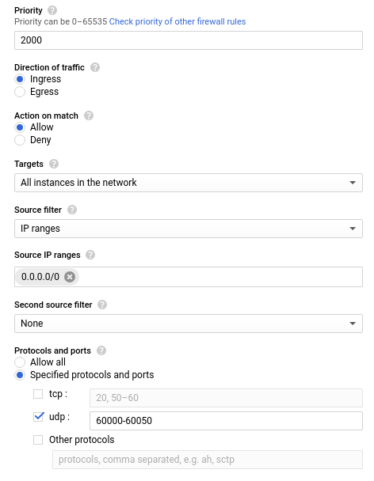

## Facing mosh UDP connection errors

For a while now, I have been looking at using a virtual machine in the
cloud for some of my development. It makes sense to me, when I am out and
about I don't always carry my notebook with me; and I can use some form of
ssh wherever I am to get some work done. Along that road I have been
looking at using mosh to connect to the machine. I am also still enrolled
in Google Cloud's so-called 'Free Tier', so it made sense to play around
with getting my development machine set up there. Only, using mosh to
connect to my instance seemed impossible.

This clearly speaks to a problem of port connectivity issue. Mosh is
either not getting into the machine, or it's not gettting *out* of it
again. From reading the mosh man page, I new that the way mosh tries to
connect is by first establishing a simple ssh connection and then
reversing the data flow and establishing a connection from the server to
your client over UDP. The port it wants to use is obviously shown in the
connection window itself. To figure out if mosh could get *into* the
server, I connected over the usual ssh connection and observed processes
for one called mosh.

As soon as I tried to connect with mosh a new process sprang up. So clearly
getting in initially did not seem to be the problem. In hindsight this makes
sense since mosh uses the normal ssh route to call up its server. If I can
connect over ssh, mosh can. The problem had to be on the UDP side. I played
aroung with the machine's iptables and my ufw installation for a long time,
thinking it had to be an issue with how I set up the firewall rules.

## Fixing the Google Cloud firewall rules

However, turns out that while firewall rules were definitely to blame, it was
not those I ever set up. Instead, Google compute engine follows its own,
external, firewall rules for virtual machines you set up. It is there you have
to specifically allow mosh to get into the server over UDP. Thankfully, the
labelling in your cloud console is pretty straightforward. The individual steps
follow as such:

Go to your Google Cloud Console and choose Firewall Rules from your big menu of
stuff (tm), it is located under the 'VPC Network' header.

Once there, create a new firewall rule to allow incoming traffic on UDP ports
60000-61000 (or whatever ports you have configured mosh to use). Be careful to
use what is called [CIDR
notation](https://en.wikipedia.org/wiki/Classless_Inter-Domain_Routing#CIDR_notation)
when specifying the source IP range. Since I want to connect from essentially
everywhere to my instance, I put `0.0.0.0/0` into the source range.

Finally set its priority to 2000, or at least a value above 1000, so that your
new rule supersedes the default firewall rules for your network.

Your firewall rule should look something like this when done:

Note that I chose a way smaller port range than mosh's default since it's only
me using the machine, and what would I ever need 1000 ports for.

With all that done, you should finally be able to log into your virtual machine
through mosh and not face the dreaded 'Nothing received from UDP' message
staring at you. If mosh is still not able to connect, you should go back and
double-check that both the firewall for your Google Cloud network *and* the
firewall on your vm instance itself are set up correctly. Now go forth and
mosh!
