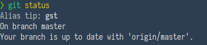
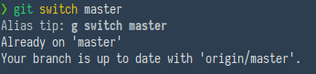

Working on the shell is often a blessing ---
you input text to transform other text and return results in even more text.
Yet, there is one thing which is the hardest part to get right:
remembering the initial inputs to get this process started.

There are innumerable commands on the shell, and while we rarely use _all_ of them,
those used most often should always be accessible at our fingertips to get the most out of this process.

## Why use aliases

<iframe src="https://fosstodon.org/@smt/105086942025992691/embed" class="mastodon-embed" style="max-width: 100%; border: 0" width="400" allowfullscreen="allowfullscreen"></iframe><script src="https://fosstodon.org/embed.js" async="async"></script>

After reading the discussion centered around [this](https://fosstodon.org/@smt/105086942025992691) mastodon toot,
I have begun thinking about the way I use shortcuts to my often-used shell commands.

I have several shell commands 'bookmarked' as shorter versions of themselves.
The reasons for using these short-form aliases come in three basic forms for me:

- commands are too long
- commands are too cumbersome to type
- I forget the actual command, due to copious or weirdly phrased options

Resulting from these three reasons,
the ideal shortcut on the shell brings three logical improvements:

- increased speed of input
- increased (mechanical) ease of input
- increased (cognitive) ease of input

These three reasons align themselves into two overarching goals:
we want to simplify how easily we can _type_ our interactions with the shell,
and we want to simplify how easily we can _think_ about interactions with the shell.

Keep these two fundamental ambitions in mind and never be afraid of removing or changing shortcuts which do not help you in reaching them.

## How to use aliases

Using aliases is simple:
writing `alias ls='ls -hAl'` is one example you have inevitably come across already.

It states that whenever you type `ls` from now on,
under the hood the command is in reality substituted for `ls -hAl`,
which will ultimately be invoked by the shell.
With this alias in place your shell will always print the long-form version of `ls`,
including any hidden files (that's the `-hAl` options).

To make your aliases permanent, as with everything,
put them in a file which your shell sources on startup,
such as `.bashrc` or `.zshrc`.

## A framework for short commands

You should strive to compose most of your command shortcuts with just two letters.
I have found this to be the sweet-spot between the trade-offs of speed and uniqueness, memorability and over-encumbrance,
as well as preventing their accidental typing.

If all your commands are solely one letter, you will inevitably type them on accident every now and again ---
plus, there is a limited set of single-letter possibilities to map your expressions to.
Use one-letter commands _sparingly_.[^oneletter]

[^oneletter]: I have for example mapped `g` to invoke `git` without any actual functionality. I can combine it with options I need less often -- `g switch mybranch` is just that bit easier than typing `git switch mybranch`. The results of this technique improve as the commands get longer. Take `docker` for instance: `d image tag` already saves keystrokes. Use the `image` sub-command frequently? Add `alias di="docker image"` to your toolbox and reduce it to `di tag`. You can see the trade-offs in action.

As commands get longer than two-letters, you trade off speed.
More importantly you also often increase the difficulty of typing them and,
often even more egregious,
the difficulty of moving your fingers between their arbitrarily-placed mnemonic letters
(imagine typing `gp` versus `gipsh` for `git push`, or `dt` versus `dmtg` for `docker image tag`).

Recognizing this trade-off is perhaps not revolutionary,
but consciously keeping it in mind when extending your command tool-set will help you organize your possibility space and create a better mental map.

Every shortcut dances between input speed and overloaded lettering, making it harder to keep in your head.
Similarly, every shortcut dances between ease of input and memorability by sticking with mnemonic character choices.
Finding the right balance between them is what will ultimately decide how useful they are to you.

<!--
* practical examples
-->

## Simple examples

I use `g` as a general shortcut for `git`, from which I can access all its sub-commands by doing `alias g=git`.
The git function I use most often are also mapped to two-letter commands:\
`alias gp="git push"`\
`alias gl="git pull"`\
`alias gst="git status"`[^gst]\
`alias gf="git fetch"`\
`alias gi="git ignore"`, which in turn refers to a script I have written to automatically create `.gitignore` files\
`alias gpa="git pushall"`, which I defined in my `git/config` file as `pushall = "!git remote | xargs -L1 -I R git push R"` to push to all connected remotes.

[^gst]: This remains a three letter command since the key combination is easy to type. `gst` was one of my earliest mappings and is much easier to type from muscle-memory, and `gs` calls the `ghostscript` program in my environment.

You can see how layers of indirection can help you reduce the legibility of a long command into the speed and typing ease of a shorter.
From the full command pipeline, to `git pushall`, to its three-letter abbreviation helps you find the original meaning but still access it with speed and ease.

For `tmux` session management I use `tm` and `tl` to create and load sessions respectively (using `fzf`, read more about it [here](../a-fzf-workflow)).

Lastly, another important shortcut is
`alias z="fasd_cd -d"`, using the [`fasd` plugin](https://github.com/clvv/fasd) to jump through my most used directories.

Generally, reserve your single-letter shortcuts for the most necessary things.
I have `g`, `z`, and `v` for `alias v=nvim` and that is it.
You can see how much more expressive you can already be by using two-letter commands,
and how much more sensible dealing with e.g. the different sub-commands of `git` is.
By adhering to mnemonics, you will also make it more easy to remember your aliases by allowing you to sound it out in your head while first learning.

## Aliases? Functions? Scripts? What to use

To enable a new command for your shell, you generally have three different options:

- Making a quick alias, akin to `alias gp="git push"`
- Building a function, like

  ```sh
    gp() {
      git push "$@"
    }
  ```

- or creating a whole separate script and putting it in the path

When is it the right option to use which of these?
Nowadays, it does not matter terribly much which one you choose for your purposes,
at least not with the specification of today's computers.

There is nevertheless a sensible distinction of what makes most sense for which purposes.[^stackanswer]
Put succinctly:
Use aliases if you only intend to always invoke an option or two, or to shorten your basic commands.
Use functions as soon as more complexity is needed ---
when it behaves slightly different on different input or contextual conditions.
Use scripts when you are creating something which could stand on its own ---
something which fulfills an entire purpose and could conceivably be shared with others who would also get a use out of it without being embedded in the same shell environment.

[^stackanswer]: Most of this is taken from the exhaustive answers over at [stackexchange](https://unix.stackexchange.com/questions/30925/in-bash-when-to-alias-when-to-script-and-when-to-write-a-function).

When you are creating new functionality it is also reasonable to start from the smallest version (alias) and move to bigger ones (function, then script) as the need arises.

As mentioned at the outset, functionally there is not too difference in computational power for today's machines.
Aliases and functions are kept in memory, so they consume more memory over time but are quicker to call repeatedly.
What _does_ make a difference though is who intends to use it.
If other programs should be able to access it and execute its functionality,
you will have to make it a script.
Since functions and aliases only exist in the _current_ shell environment,
they can not be called by other programs.[^watch]
If the intent is to _change_ things about your current environment however,
only functions and aliases are able to do that.

[^watch]: The easiest way to demonstrate this difference, and one I stumble over time and time again, is trying to observe some command with `watch`. Since `watch` is a program running in a shell that does not have access to your current environment, aliases and functions will not be accessible to it. `watch gst` invariably returns an error when I forget this, and I have to rewrite it in full as `watch git status`.

Ultimately, then, most of your shortcuts will invariably be aliases with a few functions thrown in.
Scripts will generally be rarer and more necessary as extended functionality for other programs,
not your daily work-flow in the shell (though of course, they often become just as much part of it).

## Helping you remember them

But how will you remember all these new shortcuts?

First off,
if you are following the above framework of least cognitive and typing effort while remaining intelligible,
and only add shortcuts when you feel like you really need it,
this should not be too big of a problem anymore.

Secondly, however,
you can have your shell environment help you out when you forget.
Externalize even more of the cognitive load required by using a plugin to tell you when you are being forgetful.

Personally, I use [alias-tips](https://github.com/djui/alias-tips) for the `zsh` shell which will,
whenever you type a long command for which you have explicitly defined a shorter alias or function,
simply remind you of that fact above the command you just typed.



This works for full aliases as well as parts of an alias you could have used,
like he following case where I had `git` aliased to `g`, but switch never defined in connection with it:



There are more shell plugins like it, written in [go](https://github.com/sei40kr/zsh-fast-alias-tips) or with slightly [extended functionality](https://github.com/MichaelAquilina/zsh-you-should-use) but I am perfectly content with the simple reminder setup.[^zshonly]

[^zshonly]: This is, however, the first time I have noticed that all these plugins are targeted at `zsh` as a shell. I am not entirely sure if an equivalent exists for e.g. `bash`, perhaps [oh-my-bash](https://github.com/ohmybash/oh-my-bash) recreates this functionality somewhere.

With all these tips it should be a breeze to incorporate more speedy and efficient commands into your daily shell-life.
Happy hacking!

<!--
* why do it
* how to do it
* how to *think* about it
* aliases? functions? scripts?
* how to remember using them (plugin)
-->
