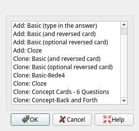

## Anki as a learning tool

Anki is generally accepted as one of the most useful spaced repetition
memorization software. The program is widely used in the medical field for
students having to memorize both conceptually disconnected facts, and those
building upon each other. In language learning, you use it to memorize new
vocabulary, grammatical constructs, and spelling.

And yet, using Anki for subjects in the humanities sometimes appears unwieldy,
as if it can not adapt to the more subjective and inter-connected nature of
their sometimes more scattershot nature. This post wants to introduce some
approaches for the layout of cards, which may help with the more
concept-centric approach of learning the fields in the humanities.

This page is not intended to give a holistic overview of the Anki interface
itself. You can use the [official
documentation](https://apps.ankiweb.net/docs/manual.html) for that, as well as
[ask more specific questions here](https://old.reddit.com/r/Anki/). The
following links also dive deeper into approaches to use [Anki for
university](http://myroadtopt.com/2016/01/09/how-to-use-flashcards-effectively/),
[specific fields](https://medshamim.com/medicine/), and setting more general
[quality-of-life settings](https://medshamim.com/med/anki-step-one). In the end
remember that you should set your Anki according to [_your_
needs](https://old.reddit.com/r/GetStudying/comments/byjowy/anki_for_painless_memorization_a_simple/)
and [specific use
cases](https://www.reddit.com/r/Anki/comments/bd1pdb/experiences_on_learning_other_than_a_language/).

## A concept driven approach

For fields like sociology, cultural studies, or literary studies, specific
concepts are generally at the root of knowledge fragments. These concepts may
consist of thinkers, their approaches to the field, literary movements,
specific theories and studies, or structured uses of other knowledge fragments.

Generally you want to be concise with your flashcards: one answer, ideally just
one word or sentence. This makes it easy to remember and quick to recall. It
does not necessarily mean you can _never_ have more than the unique answer on
the back of your card though. It can be much more useful to create one slightly
bigger back of the card -- the concept you want to get across -- and then add
all your questions to it, each treated as an singular 'front-half' of the card.
In other words, you can create a lot of questions around one concept while
re-using the same back of the card and not having to retype the answers.

This approach is useful if you want to follow the advice of asking each
knowledge tidbit in both directions (and I would strongly suggest you do so).
That means, if you want to know the name of a specific theory, you name its
creator and then ask for the name of their theory. Or you explain the content
and ask for a name. But then you turn it around and just name the theory and
ask for the content or its creator as well. That way you link the knowledge
both ways and don't just linearly regurgitate without connecting it. More than
one question per card can help massively with this idea.

## Creating Anki concept cards - different questions per concept

To create these kinds of cards, open Anki and select `Tools` -> `Manage Note
Types`. A window like the one below pops up.

Here, select `Add` to create a new card type. I went with `Clone Basic (and
reversed card)`, but you can just create a new one as well.

When you have selected the archetype of card to start from, we need to now
focus on the fields the card needs to have. For that, unsurprisingly, click on
`Fields...`. A new dialog opens, presenting you with the fields your card will
carry. Now add, rename, and reposition your fields until you have something
resembling the following:

For this example, I went with 5 questions per card-back. The concept field
itself will not appear on my cards, but I will use it as the card 'name' to
find it later on the card browser. Since my cards revolve around concepts
anyway, I just call it the Concept field. You can have different make-up of
fields -- later on we will see another idea for fields linking your answers
back and forth. When you're happy with the fields go ahead and close the
creation dialog. We will now make the different fields appear on our cards by
clicking the `Cards...` button.

In the card creation dialog You have a field for the front of your card, the
back of your card, and any styles that you wish to apply. Go ahead and put {Q1}
on the front template, and {Back} on the back template (or whatever you called
the respective fields when you created them). Then, click on the `Options`
drop-down and `Add Card`. It will clone the current card. There, you have to
change {Q1} to {Q2} and you have connected the second question to your card's
back-side. Repeat this until you have all your questions connected to the back
of the card -- it looks something like this:

Close the card and notes creation windows. That's it, you're done. Now, when
creating new flashcards, you will have access to your new card type in the top
bar of the creation dialog. Choose it and you will see all five Question fields
presented to you, along with the Concept (ie, name) field, and the back-side.

You can have arbitrarily amounts question fields, though I use a _limit_ of
five. Any more than that and the back is too crowded to be of actual use to
you. Generally, I stick with around four questions per Answer side. Any
question field you leave empty will not create a card -- you don't have to
worry that there will be a bunch of empty question sides while reviewing.
That's it, and makes creating cards centered around complex concepts a bit
easier in the long run.

## Linking concepts back and forth

Similarly to language learning, the concepts you create can aid not just
learning in the direction of `Question -> Answer`, but also `Answer ->
Question`. Unlike language learning the transition in both directions can be
a bit more unwieldy if you have a large back side on the card, and no direction
what to ask. Here, you have two possibilities:

You can expand the concept of `Q1 -> A, Q2 -> A, …` that we learned in the last
section with 'reverse' questions (If asking for the descriptions of a concept
question one, describe it in question two and ask for its name). These you
don't have to call anything special -- but calling them RQ1 or something
similar can remind you of the idea.

The other option is to make the back side of your card a 'Cloze' puzzle on its
own, where you hide parts of the answer and you have to remember the part you
don't see. This can work better for some concepts than for others, since for
some concepts it's not clear what goes where part of the answer hides the
original meaning.

Generally, I prefer the first option since it works naturally with the
multi-question concept anyways and just expands on it to remind you to keep
your question links in both directions. I have created another card type for
this and called it Concept - with reverse. There, I have added more questions
and given them a special name to remind me to reverse my input for everything
I ask.

## Moving from retention to deep learning

The methods above, concept learning, different questions per idea,
back-and-forth linking of definitions all help with _retention_ of the subject
matter. To truly master concepts, and thus also make use of them
beyond learning for a specific exam, retention is just one third of the things
you can do with your knowledge fragments. The other two parts are
_comprehension_ and _application_. Now, it appears as if you are using
comprehension in this kind of learning if you wrote the definitions of concepts
yourself. But that doesn't have to be the case -- even more so if your
definitions stem out of textbooks, or are what the tutor defined.

Sometimes called _Flashcard Plus_ (which makes it sound 15% more buzzword-y),
they contain two more steps you can take when reviewing your flashcards. Don't
just test yourself on the knowledge that is _on_ the card (repeating it, ie,
enhancing retention), but re-define it in your own words, and lastly create an
example with which you show what the concept stands for, or how the concept
applies to things. Both of those contain ideas that are _not_ already found on
the card. That makes them both hard to prepare for when creating the cards, and
hard to predict where you want to make use of them.

I use a straightforward way to remind myself of these two steps: I add a [D]
for concepts which I would like myself to redefine, or an [E] for concepts for
which I would like to find examples. I add these to the questions themselves,
though sometimes adding them to the back-side of the card can also work,
specifically for examples which are not printed there already. Don't go
overboard with these tags or they will slow you down immensely when it's time
to review -- which will make it much more probable for you to just skip the
extra steps instead of helping.

## Organizing your cards

Depending on your subjects and the amount of cards you create, it will be
tempting to split the cards you create into different decks or sub-decks. This
becomes even more enticing with the amount of cards we create for each single
concept which can range anywhere from 3 question to 6 or higher, more so if we
link our questions back and forth.

I would still argue against splitting your cards into a lot of separate decks
since it minimizes the effect of 'spacing' your flashcards (as opposed to
massing them, which is less effective for learning). Long-term, I try to
decrease my usage of decks and maximize that of tags. They allow you to sort,
filter, and access the specific cards you need without precluding you from
still dealing with _all_ of them in the order Anki thinks best for you. That is
a big benefit and should be your primary method of learning. Create tags for
the module a concept belongs to, as well as the specific lecture if that's
important to you. But try not splitting different modules into different decks,
and under no circumstances split the lectures into different sub-decks.

If you find yourself overwhelmed with a long list of tags after a while, you
can use the [Hierarchical Tags
add-on](https://ankiweb.net/shared/info/1089921461) to create sub-categories
for the lectures. If you want, you can add rough categorization of the concept
in another tag, but do not go overboard with this either. It merely hinders the
card creation flow and you will find that you make little use of truly
fine-grained tags.

## To reiterate

To make effective use of Anki for academic learning in the humanities, keep the
following in mind:

- Center your cards around concepts as singular pieces of knowledge
- Ask more than one question for the same concept, from a variety of angles
- Link your answers and questions back and forth by adding 'reversed' cards
  (if suitable)
- Incorporate Comprehension and Application into your learning by finding new
  definitions and examples for your concepts
- Remind yourself of these two steps by adding [D] and [E] on your cards
  -- but use them sparingly
- Try to reduce your use of separate decks and instead use tags to organize
  your cards -- don't go overboard with tagging, you can always search keywords.

These tips allow you to be able to incorporate Anki into your learning process,
regardless of the actual field of study. The steps, while working for STEM
education, medicine, or even personal learning, aim at learning for the
humanities and will make it easy to take advantage of one of the best spaced
repetition software out there.

Thanks for reading.
